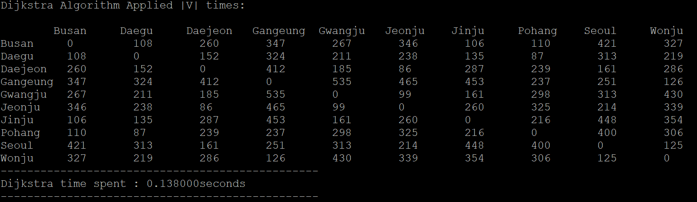
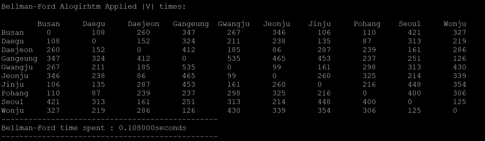
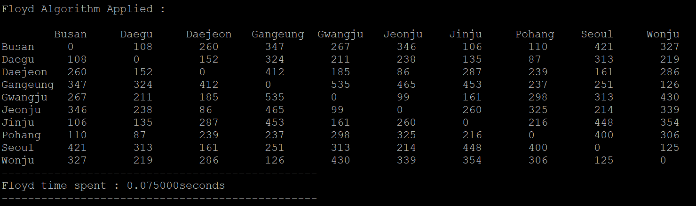

## Program For finding ShortestPath in 3 ways ##

This repository is for 2018-1 Algorithm Analysis hw5
This repository provides Makefile to build program

-------------
### How to run ###

1. Simply command as below to make executable file of this program :  
<code> $ make </code>

2. Then command as below to run program :  
<code> $ ./sPath </code>

3. Cleaning binary files of current directory can be done by :  
<code> $ ./make clean </code>

* *If you want to use different input file, you only need to modify input file name in scc.c file.*

### Screen shots ###
1. First screesnshot shows result of shortestPath and its running time, when Dikjstra algorithm is applied |V| times.

2. Second screenshot shows reulst of shortestPath and its running time when Bellman-Ford algorithm is applied |V| times.

3. Last screenshot shows result of shortestPath and its running time, when Floyd-Warshall algorithm is applied.

